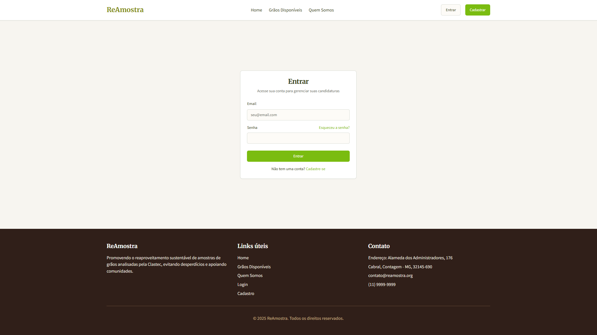
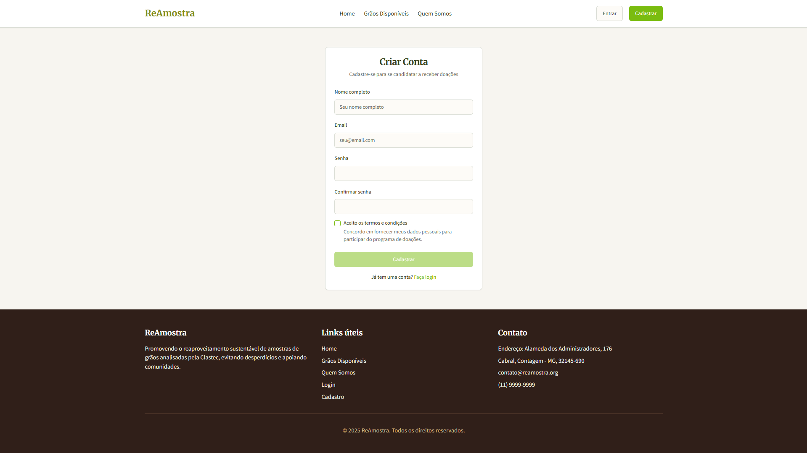
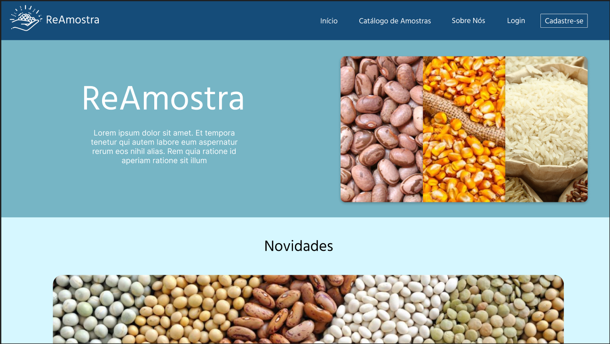
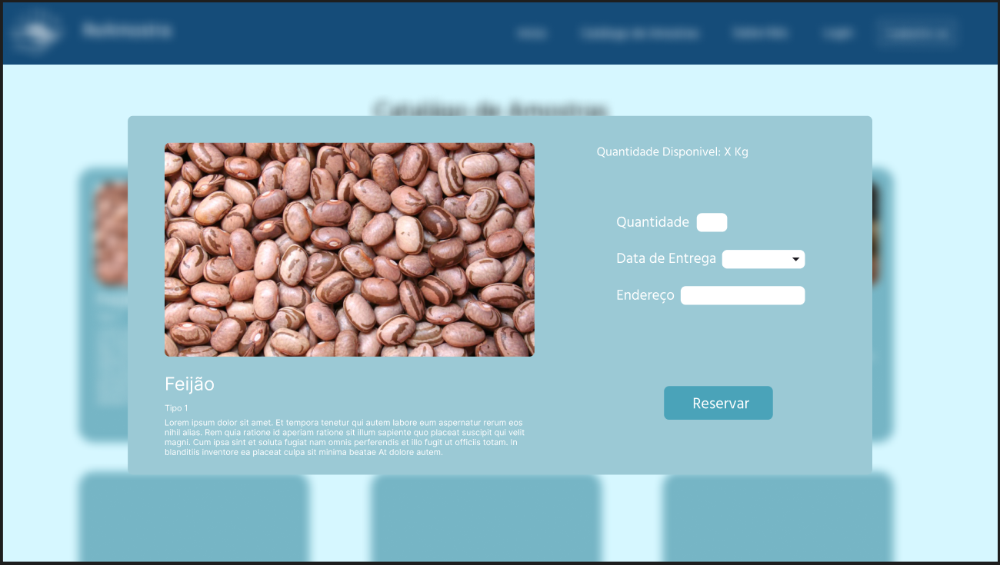
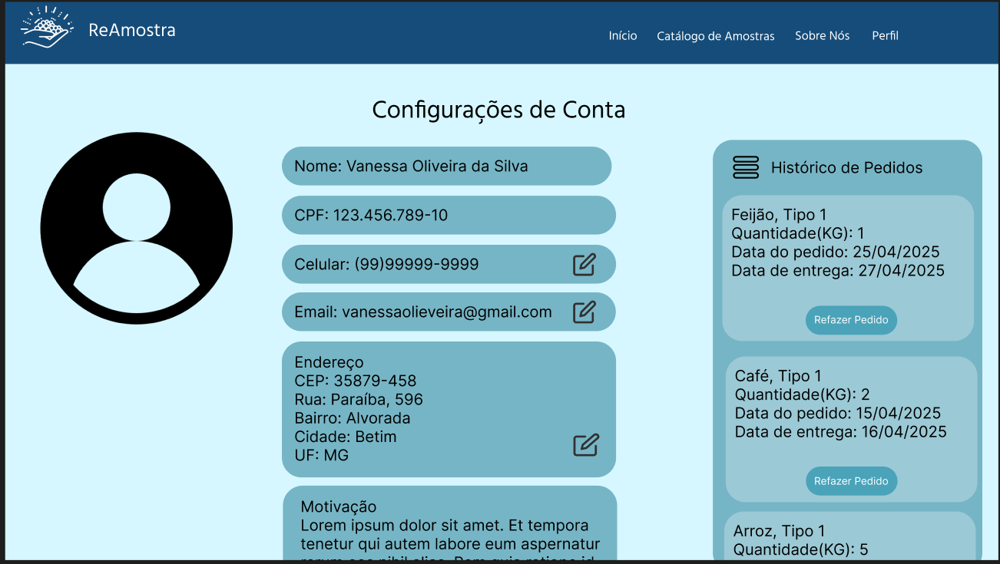
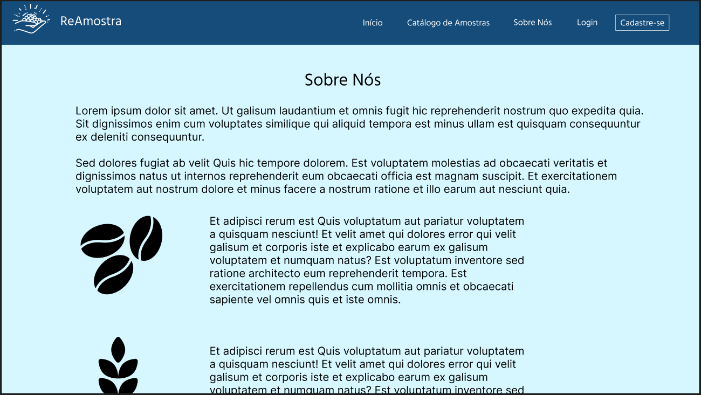
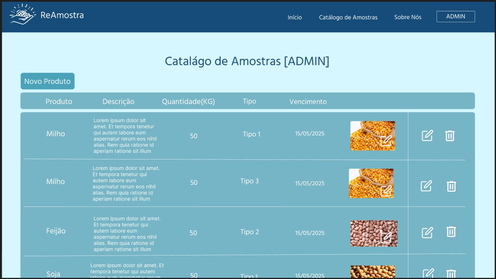
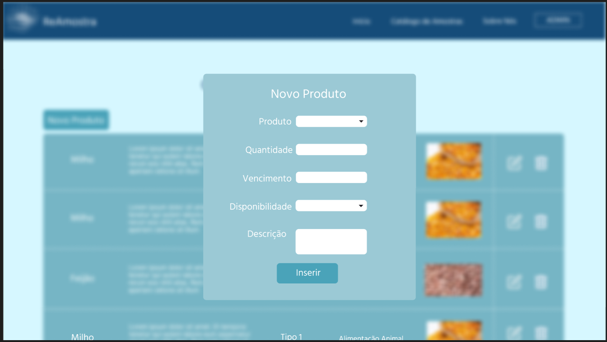
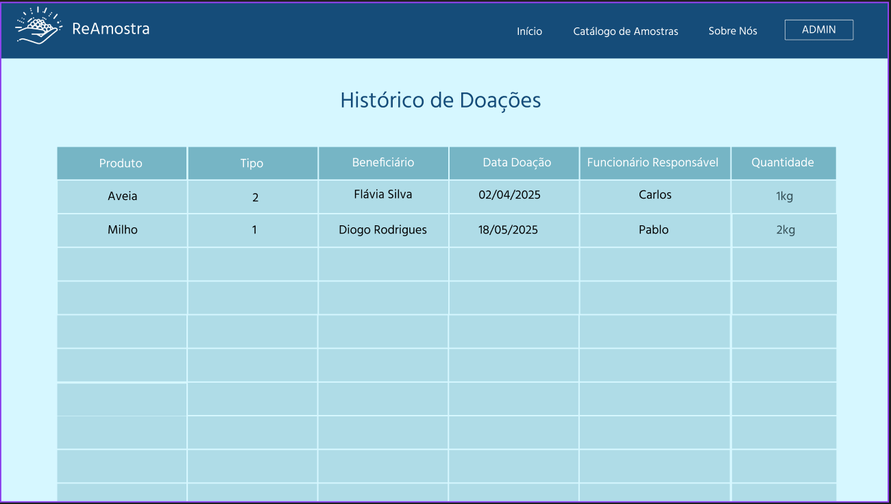

# Projeto de interface

Pré-requisitos: <a href="02-Especificacao.md"> Especificação do projeto</a>

Visão geral da interação do usuário pelas telas do sistema e protótipo interativo das telas com as funcionalidades que fazem parte do sistema (wireframes).

 Apresente as principais interfaces da plataforma. Discuta como ela foi elaborada de forma a atender os requisitos funcionais, não funcionais e histórias de usuário abordados na <a href="02-Especificacao.md"> Especificação do projeto</a>.

 ## User flow

<!--
Fluxo de usuário (user flow) é uma técnica que permite ao desenvolvedor mapear todo o fluxo de navegação do usuário na aplicação. Essa técnica serve para alinhar os caminhos e as possíveis ações que o usuário pode realizar junto com os membros da equipe.
-->

<!--
> **Links úteis**:
> - [User flow: o quê é e como fazer?](https://medium.com/7bits/fluxo-de-usu%C3%A1rio-user-flow-o-que-%C3%A9-como-fazer-79d965872534)
> - [User flow vs site maps](http://designr.com.br/sitemap-e-user-flow-quais-as-diferencas-e-quando-usar-cada-um/)
> - [Top 25 user flow tools & templates for smooth](https://www.mockplus.com/blog/post/user-flow-tools)
-->

<!--
### Diagrama de fluxo

O diagrama apresenta o estudo do fluxo de interação do usuário com o sistema interativo, muitas vezes sem a necessidade de desenhar o design das telas da interface. Isso permite que o design das interações seja bem planejado e tenha impacto na qualidade do design do wireframe interativo que será desenvolvido logo em seguida.

O diagrama de fluxo pode ser desenvolvido com “boxes” que possuem, internamente, a indicação dos principais elementos de interface — tais como menus e acessos — e funcionalidades, como editar, pesquisar, filtrar e configurar, além da conexão entre esses boxes a partir do processo de interação.

> **Links úteis**:
> - [Como criar um diagrama de fluxo de usuário](https://www.lucidchart.com/blog/how-to-make-a-user-flow-diagram)
> - [Fluxograma online: seis sites para fazer gráfico sem instalar nada](https://www.techtudo.com.br/listas/2019/03/fluxograma-online-seis-sites-para-fazer-grafico-sem-instalar-nada.ghtml)
-->

## Wireframes

São protótipos usados no design de interface para sugerir a estrutura de um site web e seu relacionamento entre suas páginas. Um wireframe web é uma ilustração que mostra o layout dos elementos fundamentais na interface.

Tela de Login

Tela de Cadastro

Página Inicial

Página Catálago

Página Catálago Reservar Grãos

Página Perfil

Página Sobre Nós

Página Catálago Admin

Página Catálago Admin Adicionar Grãos

Página Histórico Admin 

<!--
> **Links úteis**:
> - [Protótipos: baixa, média ou alta fidelidade?](https://medium.com/ladies-that-ux-br/prot%C3%B3tipos-baixa-m%C3%A9dia-ou-alta-fidelidade-71d897559135)
> - [Protótipos vs wireframes](https://www.nngroup.com/videos/prototypes-vs-wireframes-ux-projects/)
> - [Ferramentas de wireframes](https://rockcontent.com/blog/wireframes/)
> - [MarvelApp](https://marvelapp.com/developers/documentation/tutorials/)
> - [Figma](https://www.figma.com/)
> - [Adobe XD](https://www.adobe.com/br/products/xd.html#scroll)
> - [Axure](https://www.axure.com/edu) (Licença Educacional)
> - [InvisionApp](https://www.invisionapp.com/) (Licença Educacional)
-->

## Interface do sistema

Visão geral da interação do usuário por meio das telas do sistema. Apresente as principais interfaces da plataforma em sua versão final.

### Tela principal do sistema

Descrição da tela principal do sistema.

> Insira aqui a tela principal do sistema

###  Telas do processo 1: Destinação das Amostras após Análise

Neste protótipo de tela, após a análise das amostras, o usúario define a destinação das mesmas.

> insira aqui a tela da atividade 1

Descrição da tela relativa à atividade 2 do processo 1.

> Insira aqui a tela da atividade 2

### Telas do processo 2: Cadastro de Gerenciamento de Amostras

Na atividade 1 do processo de "Cadastro de Gerenciamento de Amostras", o usuário administrador visualiza todas as amostras já cadastradas.

Na atividade 2 do processo "Cadastro de Gerenciamento de Amostras", o usuário administrador interage com a aplicação para adicionar um novo cadastro de amostra ou remover um cadastro já existente.

## Jornada do Usuário

Descrição:
Joana é uma funcionária que utiliza o sistema para consultar amostras disponíveis e verificar informações relevantes. Ela não pode alterar os dados do sistema.

Etapas:
Login

#### Joana acessa o sistema com sua conta de usuária comum.

📍 Tela: Login

Página Inicial (Home)

#### Visualiza as categorias disponíveis e acessa o catálogo de amostras.

📍 Tela: Home

Catálogo de Amostras [user]

#### Explora as amostras disponíveis com visual de imagem e dados como validade e tipo.

📍 Tela: Catálogo de Amostras [user]

Visualização Detalhada

#### Ao clicar em uma amostra, vê as informações completas (descrição, localização, status).

📍 Tela: Catálogo de Amostras [user] (detalhe)

Perfil de Usuário

#### Atualiza seus próprios dados de conta e redefine senha, se necessário.

📍 Tela: Perfil de Usuário

Seção “Sobre Nós”

#### Conhece o propósito do sistema e sua importância para o reaproveitamento.

📍 Tela: Sobre Nós
